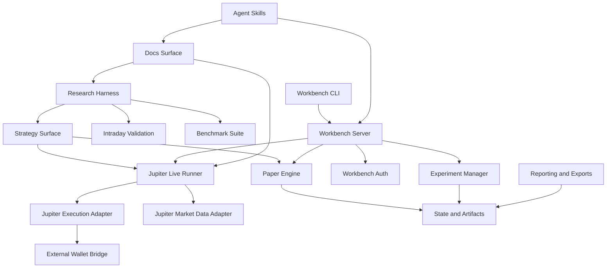

# Auto-Research-Trading Codebase Knowledge Graph

Last updated: 2026-04-06

## Purpose

This file is a Markdown knowledge-graph representation of the repo.
It maps the major modules, execution surfaces, and capabilities as a network rather than a tree.

## Graph Summary

- Core domain: backtest-first crypto research and execution tooling
- Primary mutable seam: `strategy.py`
- Core runtime clusters:
  - research harness
  - intraday validation
  - paper and live execution
  - operator workbench
  - experiment management
  - reporting and exports
  - docs and agent guidance

## Capability Clusters

### Research Harness

- `prepare.py`
  - historical data download
  - cache layout
  - backtest engine
  - score calculation
  - shared dataclasses: `BarData`, `PortfolioState`, `Signal`
- `backtest.py`
  - canonical hourly validation path
  - fixed evaluation entrypoint
- `run_benchmarks.py`
  - benchmark comparison runner
- `benchmarks/*.py`
  - fixed reference strategies

### Strategy Layer

- `strategy.py`
  - mutable trading logic
  - consumes market and portfolio state
  - emits target-position signals
  - optional lightweight strategy state persistence

### Intraday Validation

- `backtest_5m.py`
  - 5-minute validation surface
  - richer artifacts for tactical review
  - Binance-first, Hyperliquid-second data sourcing

### Paper and Replay Execution

- `paper_engine.py`
  - simulated fills
  - portfolio transitions
- `paper_trade.py`
  - replay / paper entrypoint
- `paper_state.py`
  - JSON persistence for paper and live-adjacent state

### Jupiter Execution

- `run_jupiter_live.py`
  - orchestration entrypoint for paper mode and guarded live mode
- `jupiter_live_adapter.py`
  - Jupiter public market-data polling
  - bar synthesis
- `jupiter_execution.py`
  - target-delta translation into Jupiter CLI-backed execution plans
- `external_wallet_bridge.py`
  - JSONL handoff review for external-wallet mode

### Operator Workbench

- `fly_entrypoint.py`
  - local dashboard server
  - HTTP control plane
  - paper-feed supervision
  - experiment-manager supervision
- `workbench_ctl.py`
  - CLI client for dashboard control
- `workbench_auth.py`
  - login and signed-session cookie auth layer

### Experiment Management

- `experiment_manager.py`
  - continuous experiment loop
  - candidate evaluation
  - state snapshots
  - cycle records and event logs
- `autoresearch_daemon.py`
  - autonomous experiment loop support and status tracking

### Reporting and Exports

- `export_equity.py`
  - equity curve export
- `export_milestones.py`
  - milestone equity exports
- `generate_charts.py`
  - chart generation from result tables
- `charts/`
  - generated chart outputs
- `artifacts/`
  - validation and generated runtime outputs

### Docs and Guidance

- `docs/agent-harness.md`
  - repo rules for agents
- `docs/backtest-5m.md`
  - intraday workflow
- `docs/jupiter-execution.md`
  - live execution guardrails
- `docs/jupiter-perps-mcp-governance-spec.md`
  - governed MCP execution design
- `docs/fly-runtime-manifest.json`
  - Fly runtime packaging contract
- `docs/skills/jupiter-rapid-execution/`
  - repo-local Jupiter execution skill contract

### Agent and Skill Surfaces

- `.agents/skills/art-auto-research`
  - repo-specific operating skill
- `.agents/skills/g-kade`
  - KADE session orchestration surface
- `AGENTS.md`
  - top-level repo operating contract
- `kade/AGENTS.md`
  - KADE-specific local overlay

## Network Map

## Node Definitions

### `Research Harness`

- Owns historical data fetching, backtest semantics, and canonical scoring
- Anchored by:
  - `prepare.py`
  - `backtest.py`
  - `run_benchmarks.py`

### `Strategy Surface`

- The only intended experimentation seam for trading logic
- Anchored by:
  - `strategy.py`

### `Intraday Validation`

- Fast-bar evaluation path for tactical strategy assessment
- Anchored by:
  - `backtest_5m.py`

### `Benchmark Suite`

- Stable reference strategies for relative comparison
- Anchored by:
  - `benchmarks/avellaneda_mm.py`
  - `benchmarks/funding_arb.py`
  - `benchmarks/mean_reversion.py`
  - `benchmarks/momentum_breakout.py`
  - `benchmarks/regime_mm.py`

### `Paper Engine`

- Simulated execution layer reusing the strategy contract
- Anchored by:
  - `paper_engine.py`
  - `paper_trade.py`
  - `paper_state.py`

### `Jupiter Live Runner`

- Orchestration entrypoint for paper mode and guarded live mode
- Anchored by:
  - `run_jupiter_live.py`

### `Jupiter Execution Adapter`

- Converts target deltas into CLI-backed order plans
- Anchored by:
  - `jupiter_execution.py`

### `Jupiter Market Data Adapter`

- Polls public Jupiter data and shapes it into tradable bar state
- Anchored by:
  - `jupiter_live_adapter.py`

### `Workbench Server`

- Local dashboard and subprocess supervisor
- Anchored by:
  - `fly_entrypoint.py`

### `Workbench CLI`

- Thin HTTP client for dashboard controls
- Anchored by:
  - `workbench_ctl.py`

### `Workbench Auth`

- Session-based auth boundary for dashboard access
- Anchored by:
  - `workbench_auth.py`

### `Experiment Manager`

- Continuous experimentation, candidate evaluation, and event/state recording
- Anchored by:
  - `experiment_manager.py`
  - `autoresearch_daemon.py`

### `External Wallet Bridge`

- Manual signing / review surface for external-wallet order files
- Anchored by:
  - `external_wallet_bridge.py`

### `Reporting and Exports`

- Converts runtime and research outputs into CSV and chart artifacts
- Anchored by:
  - `export_equity.py`
  - `export_milestones.py`
  - `generate_charts.py`

### `State and Artifacts`

- Filesystem persistence across cache, dashboard, paper/live state, and output artifacts
- Main locations:
  - `~/.cache/autotrader/data`
  - `~/.cache/autotrader/workbench`
  - `~/.cache/autotrader/live`
  - `artifacts/`
  - root `results.tsv` and `equity_curve*.csv`

### `Docs Surface`

- Operating contracts, execution guidance, governance specs, and packaging rules
- Main locations:
  - `docs/`
  - `.planning/codebase/`

### `Agent Skills`

- Repo-local automation and briefing surfaces
- Main locations:
  - `.agents/skills/`
  - `AGENTS.md`
  - `kade/`

## Key Relationships

- `prepare.py` defines the shared dataclasses that both backtests and paper/live-adjacent execution reuse.
- `strategy.py` is the decision boundary for:
  - `backtest.py`
  - `backtest_5m.py`
  - `paper_trade.py`
  - `run_jupiter_live.py`
- `run_jupiter_live.py` depends on:
  - `jupiter_live_adapter.py` for market data
  - `jupiter_execution.py` for live order planning
  - `paper_engine.py` for paper mode
- `fly_entrypoint.py` supervises:
  - the paper-feed process
  - the experiment-manager process
- `workbench_ctl.py` does not own process supervision; it only calls the dashboard HTTP API.
- `external_wallet_bridge.py` is not a signer; it is a review and submission-tracking surface for JSONL handoff files.
- `workbench_auth.py` protects the dashboard route surface while leaving `/healthz` available for health checks.

## Capability Inventory by User Goal

### Backtest a strategy

- `backtest.py`
- `prepare.py`
- `strategy.py`

### Benchmark against fixed strategies

- `run_benchmarks.py`
- `benchmarks/`

### Validate intraday behavior

- `backtest_5m.py`

### Run paper trading or replay

- `paper_trade.py`
- `paper_engine.py`
- `paper_state.py`
- `run_jupiter_live.py --execution-mode paper`

### Run guarded live Jupiter execution

- `run_jupiter_live.py --execution-mode live`
- `jupiter_execution.py`
- `jupiter_live_adapter.py`
- external `jup` CLI

### Use external wallet review flow

- `run_jupiter_live.py --wallet-mode external`
- `external_wallet_bridge.py`

### Operate the local dashboard

- `fly_entrypoint.py`
- `workbench_ctl.py`
- `dashboard_template.html`
- `assets/logo.png`

### Run continuous experiment management

- `experiment_manager.py`
- `autoresearch_daemon.py`
- workbench subprocess supervision

### Export charts and reports

- `export_equity.py`
- `export_milestones.py`
- `generate_charts.py`

### Understand repo rules and guidance

- `AGENTS.md`
- `docs/agent-harness.md`
- `.planning/codebase/*.md`
- `.agents/skills/*`

## Current Gaps and Boundaries

- The repo is local-operator-first, not package-first.
- There is no real production web framework or database layer.
- The Jupiter MCP governance spec exists as design guidance, not a wired execution server in this repo.
- Lending and multiply are defined in skill/design guidance, but not yet implemented as first-class runtime capabilities in the repo code.
- Generated outputs and source files still share the repo root, which is efficient for local work but noisier for packaging and indexing.

## Suggested Follow-on Artifacts

- `CODEBASE_KNOWLEDGE_GRAPH.json`
  - machine-readable node and edge inventory
- `CODEBASE_CAPABILITY_MATRIX.md`
  - user goals mapped to entrypoints, trust boundaries, and verification commands
- ACE graph export
  - blocked in this session by the remote ACE graph endpoint returning `Method not allowed`
